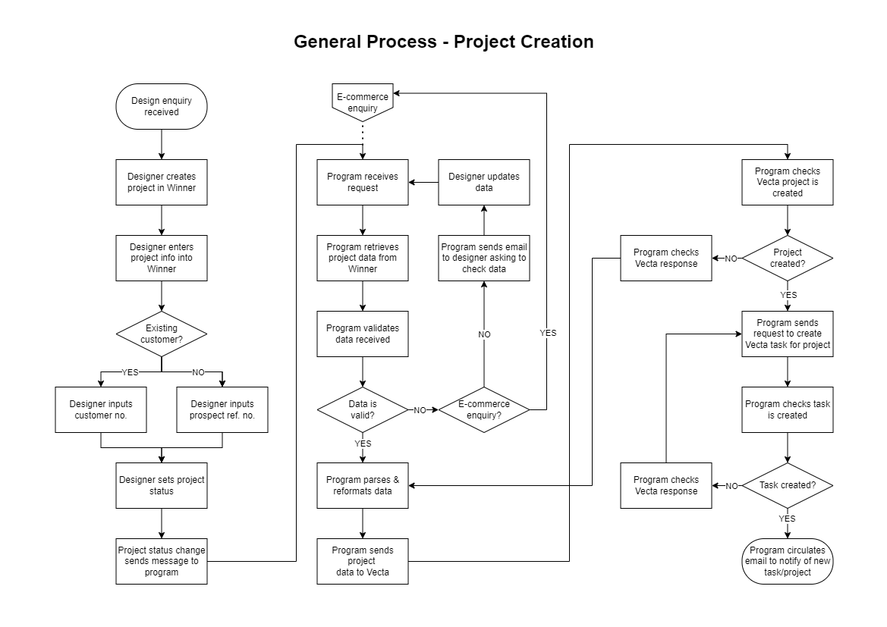

# BRIEF - Winner-Vecta API Bridge

## Background

#### Within BA:
- The Design Team uses the Winner Flex platform to undertake kitchen design work
- The Commercial Team uses Vecta as a CRM for tracking leads/sales opportunities etc.

As of current, the design team must replicate any project data created in the Winner platform, manually within the Vecta platform.

## Project Brief Summary
This project is to develop a program/set of programs to bridge data between the Winner API and the Vecta API. Program will enable automatic transfer of certain data between BA's databases on either platform.

#### Benefits:
- Reduce administrative workload within the Design Team (manually replicating data from Winner within Vecta)
- Increase data integrity by reducing errors from such replication
- Commercial still have visibility of the Design Team's projects/leads
- Visibility may potentially be increased (for example, if any manual entries were previously missed)

## Requirements
This section is likely to develop as the project progresses, and is by no means exhaustive.
Below details requirements identified so far.

#### Pre-requisites
- Machine Host (with network connectivity)
- Runtime environment (likely to be a NodeJS setup)
- Winner API Key
- Vecta API Key
- Vecta user login credentials (Vecta API uses token-bearing as extra security protocol)

#### Deliverables
- <b>Script environment ("program"):</b> to be able to handle relevant requests, send relevant comms, and handle all data transfer logic between Winner and Vecta, except for:-
- <b>Vecta-to-Winner control ("send button"):</b> this will be a small program to be used by the Kitchen Kit operator, when sending a project created in Vecta over to Winner* 

<i>*This is to overcome a limitation in the Vecta API spec, in that the API cannot currently send automatic requests/calls in response to activity on the platform ("webhooks"). Vecta's team have advised that they are looking to implement this functionality in a future release, at which time we may be able to automate this</i>

#### Scope
- Initial aim is to develop the bridge to be able to handle <b>project and task creation</b>
- Once this is operational, will develop in the ability for it to handle <b>project status updates</b>
- Once Vecta API implements webhooks, will seek to automate the E-Commerce project creation flow (removing need for "send button")
- Test integrity of program in all use cases
- Initialise and host program in perpetual runtime environment

## Process Flows
The API bridge will need to allow the transfer of data for design projects, either from Winner to Vecta, or case-depending, from Vecta to Winner. The data flow depends upon the route to market/customer type.

- Blossom Avenue/Retail =  <b>Winner -> Vecta</b>
- Kitchen Kit Merchants/Trade = <b>Winner -> Vecta</b>
- Kitchen Kit E-Commerce = <b>Vecta -> Winner -> Vecta</b>

