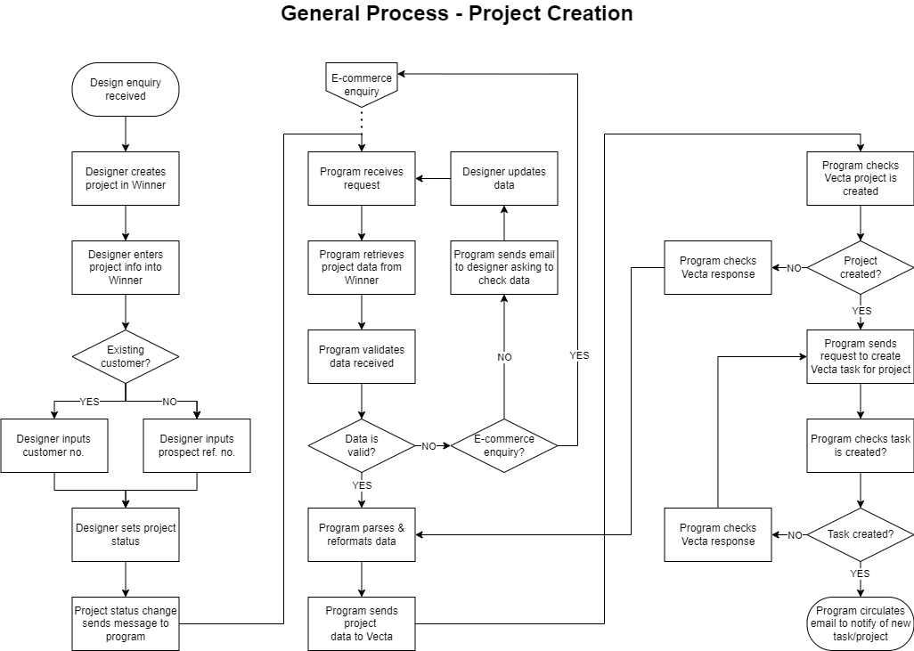
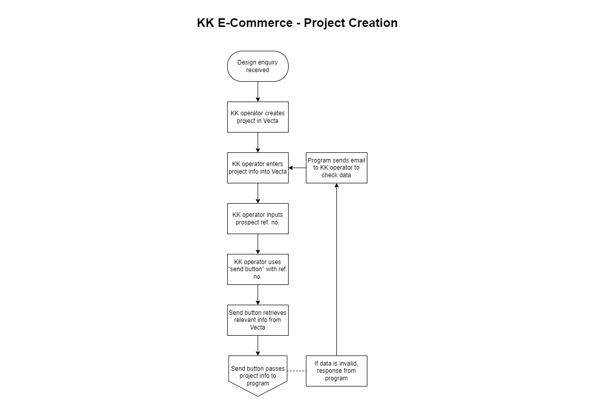

# BRIEF - Winner-Vecta API Bridge

## Background

#### Within BA:
- The Design Team uses the Winner Flex platform to undertake kitchen design work
- The Commercial Team uses Vecta as a CRM for tracking leads/sales opportunities etc.

As of current, the Design Team must manually replicate any design project data created in the Winner platform, within the Vecta platform. This creates administrative overhead, detracting from time available to allocate to design work. In addition, any projects not yet created within Vecta are not yet visible by the Commercial Team, and as a consequence are not chaseable as a business pipeline opportunity.

## Overview
This project is to develop a program/set of programs to communicate data between the Winner API and the Vecta API. Program will enable automatic transfer of certain data between BA's databases on either platform.

#### Goals:
- Reduce administrative workload within the Design Team (manually replicating data from Winner within Vecta)
- Increase data integrity by reducing errors from such replication
- Increase project pipeline visibility for Commercial Team

## Requirements
This section is likely to develop as the project progresses, and is by no means exhaustive.
Below are details on requirements identified so far.

#### Pre-requisites
- [ ] Host machine/VM with network connectivity (only required prior to deployment)
- [x] Runtime environment (NodeJS)
- [x] Winner API key
- [x] Vecta API key
- [x] Vecta user login credentials (Vecta API uses token-bearing as extra security protocol)

#### Deliverables
- <b>Data transfer client ("program"):</b> to be able to handle relevant requests, send relevant comms, and handle all data transfer logic between Winner and Vecta, except for:-
- <b>Vecta-to-Winner control ("send button"):</b> this will be a small program to be used by the Kitchen Kit operator, when sending a project created in Vecta over to Winner* 

<i>*This is to overcome a limitation in the Vecta API spec, in that the API cannot currently send automatic requests/calls in response to activity on the platform ("webhooks"). Vecta's team have advised that they are looking to implement this functionality in a future release, at which time we may be able to automate this</i>

#### Scope
- Initial aim is to develop the bridge to be able to handle <b>project and task creation</b>
- Once this is operational, will develop in the ability for it to handle <b>project status updates</b>
- Once Vecta API implements webhooks, will seek to automate the E-Commerce project creation flow (removing need for "send button")
- Test integrity of program in all identified use cases
- Initialise and host program in perpetual runtime environment
- Ongoing: consult stakeholders for potential future use cases, as business processes develop

## Process Flows
The API bridge will need to allow the transfer of data for design projects from Winner to Vecta or, case-depending, from Vecta to Winner. The data flow depends upon the route to market/customer type.

- Blossom Avenue/Retail =  <b>Winner -> Vecta</b>
- Kitchen Kit Merchants/Trade = <b>Winner -> Vecta</b>
- Kitchen Kit E-Commerce = <b>Vecta -> Winner -> Vecta</b>

## Stakeholders & Personnel

#### Audience
- BA Design Team
- BA Commercial Team
- BA Marketing Team

#### Team Responsibilities
- IT Administrator:
    - Consult with stakeholders for project requirements
    - Develop, test and deploy the API bridge application
    - Report on project progress, highlighting risks/obstacles
- IT Manager:
    - Identify & advise host location for application to enable deployment
- Office Operations Manager:
    - Manage comms between IT and Marketing/Commercial teams

## Timeline
- <b>Provisional deadline: </b> 31/10/2024
- W/C 14/10/2024: week to dedicate to investigating feasibility of in-house development:
    - 18/10/2024: should be able to demonstrate comprehensive program functionality, as proof-of-concept
    - If path forward seems unviable, will seek external support from Winner/Vecta
- 19/10/2024 to 31/10/2024: complete project development
