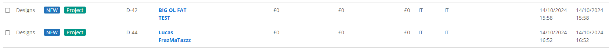

### 15/10/2024
#### Status: Mapping data flows
- The process for getting all data required into Vecta will need a few more stages than originally thought
- There will essentially have to be a zig-zag of calls between Winner and Vecta before all desired project info is transferred. The reason being, is that at project creation stage, you cannot enter all info straight away. Data such as External Ref (which we're going to use for customer no.), Project status, Value - the headers that contain these values within the Winner portal are all greyed out, until the project is saved/created. So a Vecta update request is necessary, once all fields are complete
- Configured a webhook that signals whenever the Winner project - working just fine
- The update calls (PUT request) in both Winner and Vecta expect a fair bit of minimum info before they'll do anything, the spec dictates this (unlike a GET request, which will happily just take the project ID as the criteria). So on each update call, you need to do a GET request and grab the necessary data to validate a PUT request. You combine this with whichever new values you're looking to update, and send
- To do this, we need a key on either side that calls the corresponding project up in the other platform's API
- We don't want to be storing GUIDs in the other's databases (overkill, and arguably a bit of a security no-no). But each API does have roundabout methods of retrieving the project GUIDs via their own Project Numbers - which would be fine to store. So the general idea for each Update Request:

    - Search the other database using Project No. 
    - Get the resulting Project GUID (and other validating fields) 
    - Combine validating values with those to be updated
    - Build the request body for Update request
    - Do Update request to the other database

- I think we need to do this once in each direction; after the initial POST to Vecta (when the project is created):

    - Vecta queries Winner, processes info, updates it
    - Winner queries Vecta, processes info, updates it (this step is actually job done altogether)

- One benefit is of course once the Winner to Vecta update process is live, it becomes functional for any project updates, making the data live within Vecta
- To accommodate all of this, each system needs to house the other's project number, which is proving quite tricky. There's an externalUniqueId field in Winner, which in the spec is listed as having the expressed purpose of housing a third party reference, so this is okay. Did a PUT to this without any issue. 
- Vecta's portal shows an updateable field, that's clearly been designated/configured for a custom Flex reference (Flex project no.). However, I can't find it anywhere in the API. This is after assigning one to a project within the Vecta portal and doing a call. I looked through the specs for Vecta's user-defined endpoints, and tried a few different things, still no luck. The spec description on these isn't very clear, and it seems from the "Get all" endpoint that there is nothing configured in there anyway. I will probably need to speak to Vecta/Kerridge support about this, and get some advice (or see if they have to switch anything on at their end)
- In the meantime, I'll park the Winner Project No. in Vecta's "description". But this will need sorting, since with this being the typical "large text field", it would really be the ideal place for the Comms 1 to 10 to be able to go
- Next focus is to thoroughly map out which calls send what data, and in response to which actions. I will also raise the question with Vecta regarding the custom field

### 14/10/2024
#### Status: Skeleton Winner Projects can now automatically transfer to Vecta
- Resolved issue surrounding Winner Projects GET calls; request header for API key needs to be lower case ("x-api-key" rather than "X-API-KEY")
- Explored a number of methods for the overall architecture, including controller-winnerClient-vectaClient. Found more ease working within singular script, for administration's sake (for the time being)
- <b>Milestone:</b> Now achieving persistently successful Winner Project endpoint calls
- Worked through/troubleshooted scripting for accessing & calling upon the Vecta database, got there eventually (the Vecta login procedure is more sophisticated than Winner's, it has a couple of extra steps)
- After a few successful POST's to Vecta, began looking to set up bridging logic. For the moment, only transferring the project's name
- Troubleshooted environment variable issues; IMPORTANT: must remember [ require('dotenv').config(); ]
- Troubleshooted server running incorrect scripts; IMPORTANT: must remember current working script needs to be in 3 locations in package.json:

        {
            "main": "scripts/server.js",
            "scripts": {
                "serve": "npm /scripts/server.js",
                "dev": "nodemon /scripts/server.js"
            }
        }

- <b>Milestone:</b> Manually transferred a project from Winner to Vecta using the script. Next is to automate this upon Winner project creation
- Created a Webhook in Winner, that sends a signal when a new project is created. This is what ngrok is for, we're basically setting up a mini web address that we give to the webhook, and set ngrok to listen. Issue is that this is freeware, whenever it gets spun up it generates a new address, so that presents a challenge to accommodate. As long as I leave the program up it'll work, but my PC can't stay on forever:
    - <b>TODO</b>: find persistent URL mechanism for webhooks
    - <b>TODO</b>: script for automatic environment setup if shutdown/failure
- Implemented more dependencies; 
    - <b>Axios</b> for requests
    - <b>Joi</b> for data validation
    - <b>ngrok</b> for gateway/ports
- Had to wrestle with ngrok/webhook a bit to get an OK response. Effectively we're setting up an endpoint within this script, so it has to point to that. Have to also parse the webhook data, and attach that to the function to fetch data from Winner (Project GUID)
- <b>Milestone:</b> Any bare-bones project created in winner can now automatically go onto Vecta. This currently only contains the project name, assigns it to Vecta's "Designs" Projects workflow, and automatically assigns IT as owner. This will work for as long as I leave this workspace/ngrok/script server running
- Also asked Luke to create a project or two, also a success. This proves the logic isn't currently tied to any one user. Still shows up under "IT" but this is as expected, it's currently hard-coded in. 
- See below image "BIG OL FAT TEST" is one I'd created, "Lucas FrazMaTazz" is Luke's (of course):

- Next is to revisit process flow, and specifically "wire up" what goes where data-wise, before implementing into script

### 13/10/2024
#### Status: One successful test call to Winner
- Initialised test server environment
- Installed various project dependencies
- Set environment parameters inc. API Keys & base URLs
- Attempted several GET calls to Winner Projects endpoint unsuccessfully, followed by one successful test call where ID parameters were hardcoded - to investigate tomorrow

### 12/10/2024
#### Status: Preparatory work
- Finished first draft of project brief
- Created process flow diagrams: General use & E-Commerce
- Initialised .gitignore to exclude TODO's and environment information
- Created development log for progress tracking
